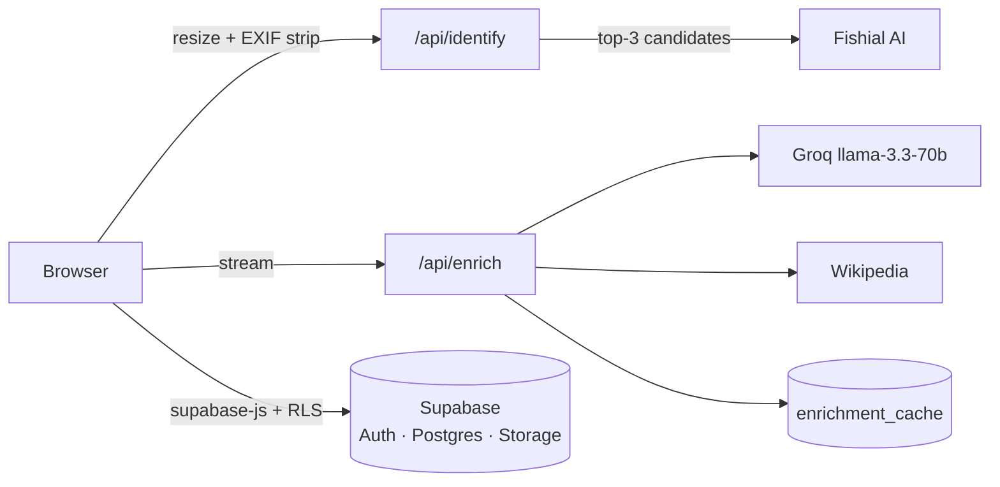

<p align="center">
  
</p>

# FishID

**AI-powered fish species identification** — upload a photo, get ranked species matches with AI-generated facts, and keep a personal fish log. Built for divers, snorkelers, and marine enthusiasts.

**Live app:** [fishid.vercel.app](https://fishid.vercel.app)

## How it works



- **One Next.js app** (App Router) on Vercel — no separate backend.
- **Supabase** owns auth (email + Google OAuth, cookie sessions), Postgres (species catalog, fish log, rate limiting, AI cache), and Storage (log photos, private bucket).
- **Two server routes** are all that's needed: `POST /api/identify` (session-gated, rate-limited proxy to the Fishial recognition API, returns ranked candidates) and `GET /api/enrich/[species]` (+`/stream`: one cached Groq completion streamed to the client, with Wikipedia as the factual backbone).
- Photos are resized and **EXIF-stripped in the browser** before they go anywhere — GPS metadata never leaves the device.
- The fish log is plain `supabase-js` under row-level security: every table and the storage bucket are owner-scoped.

## Features

- 📷 Photo upload with mobile camera capture
- 🐠 Ranked top-3 species matches with confidence bars (fish ID is genuinely ambiguous — the UI says so)
- ✨ AI-generated description, visual ID cues, and a fun fact, streamed in live and cached per species
- 📒 Personal fish log with photos, candidates, and dates
- 🔍 Searchable species catalog with habitat/region/conservation filters
- 🔐 Supabase Auth: email + password (with confirmation) and one-tap Google sign-in

## Development

```bash
pnpm install
pnpm dev          # localhost:3000
pnpm typecheck && pnpm lint && pnpm test && pnpm build
```

`.env.local`:

```
NEXT_PUBLIC_SUPABASE_URL=...
NEXT_PUBLIC_SUPABASE_ANON_KEY=...
FISHIAL_CLIENT_ID=...
FISHIAL_SECRET=...
GROQ_API_KEY=...
SUPABASE_SERVICE_ROLE_KEY=...   # server-only
```

Database schema and RLS policies live in [`supabase/migrations/`](./supabase/migrations); the species seed is in [`supabase/seed/`](./supabase/seed). CI (GitHub Actions) runs typecheck, lint, unit tests, and build on every push.

## Attribution

- [Fishial](https://fishial.ai) — fish recognition API
- [Groq](https://groq.com) — LLM inference
- Wikipedia — species summaries and reference images
- Fish icons by Freepik (see [docs/fish-icons-license.html](./docs/fish-icons-license.html))

## License

[MIT](./LICENSE) — © Hrishi Kabra ([@hrishikabra](https://instagram.com/hrishikabra) · [LinkedIn](https://linkedin.com/in/HrishiKabra) · kabrahrishi@gmail.com)
