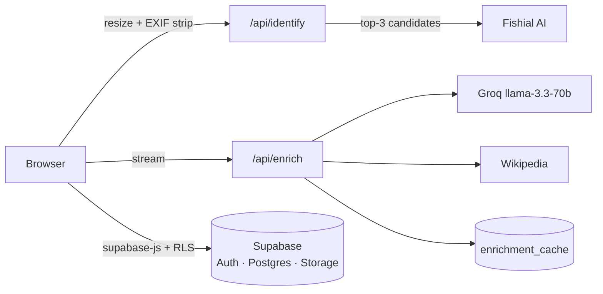

# FishID Phase 6: Polish + Audit Implementation Plan

> **For agentic workers:** REQUIRED SUB-SKILL: Use superpowers:subagent-driven-development (recommended) or superpowers:executing-plans to implement this plan task-by-task. Steps use checkbox (`- [ ]`) syntax for tracking.

**Goal:** Turn the working app into a clean portfolio piece: strict builds, pruned dependencies, shared layout components, camera capture, security headers, unit tests + CI, a security-advisor pass, and documentation that matches reality.

**Architecture:** Prune-first (all 28 strict-TS errors live in unused shadcn components, so deletion fixes type-checking nearly for free), then flip builds to strict, then layered additions: shared `SiteHeader`/`SiteFooter`, vitest unit tests over the server modules and identify route, GitHub Actions CI, and docs.

**Tech Stack:** vitest, GitHub Actions, Dependabot, CSP headers via `next.config.mjs`.

**Scouted facts (2026-06-12, don't re-derive):**
- `npx tsc --noEmit` → 28 errors, ALL in unused `components/ui/*` files importing never-installed packages (calendar, carousel, chart, command, drawer, form, input-otp, resizable, sidebar) plus `components/theme-provider.tsx` (`next-themes` not installed).
- `console.log` count in `app|components|lib|hooks`: **0** (Phases 3–5 rewrites removed them all). Verify, don't strip.
- Status-color helper dedupe from the spec is moot: after the Phase 4 results rewrite, only `app/species-list/page.tsx` still defines `getStatusColor/getStatusText`. Verify single copy, skip extraction.
- UI components used outside `components/ui/`: **button, card, input, badge, progress, select, label** (+`toast` has 1 external ref — find it; it's likely `hooks/use-toast.ts`, which itself may be unused).
- No ESLint config exists (`next lint` prompts interactively).
- Species pagination renders hardcoded pages `1..min(5, totalPages)`.
- `components/file-upload.tsx` has a single file input, no `capture` option — the approved v1 camera-capture feature is missing.
- 27 `@radix-ui/*` deps in package.json; only `react-select`, `react-progress`, `react-label`, `react-slot`, and possibly `react-toast` are needed by the keep-set.

**Deviation from spec §10, stated up front:** the automated Playwright smoke test is deferred. Every phase shipped with a scripted real-browser E2E pass (signup, identify, save, delete, RLS leak checks), and wiring Playwright + a seeded Supabase user into CI is a project of its own. CI gets typecheck + lint + unit tests + build. If the user objects, say so before executing.

---

### Task 1: Prune unused shadcn components and dependencies

**Files:**
- Delete: ~43 files in `components/ui/`, `components/theme-provider.tsx`, possibly `hooks/use-toast.ts` + toast components

- [ ] **Step 1: Resolve the toast question**

Run: `grep -rn "use-toast\|Toaster\|toast(" app components lib hooks --include="*.tsx" --include="*.ts" | grep -v "components/ui/"`
If the only hits are inside `hooks/use-toast.ts` itself (or nothing), toast is dead: include `components/ui/toast.tsx`, `components/ui/toaster.tsx`, `components/ui/use-toast.ts`, and `hooks/use-toast.ts` in the deletion below. If a page actually uses it, keep all four and keep `@radix-ui/react-toast`.

- [ ] **Step 2: Delete everything in `components/ui/` EXCEPT the keep-set** (`button.tsx, card.tsx, input.tsx, badge.tsx, progress.tsx, select.tsx, label.tsx` — and the toast set only if Step 1 said keep):

```bash
cd components/ui
git rm -q $(ls | grep -vE "^(button|card|input|badge|progress|select|label)\.(tsx|ts)$")
cd ../..
git rm -q components/theme-provider.tsx
# plus hooks/use-toast.ts etc. per Step 1
```

(Adjust the grep keep-pattern if toast stays.)

- [ ] **Step 3: Remove now-unused dependencies.** Keep `@radix-ui/react-select`, `@radix-ui/react-progress`, `@radix-ui/react-label`, `@radix-ui/react-slot` (+ `react-toast` if kept). Remove the rest:

```bash
pnpm remove $(node -e "
const p = require('./package.json');
const keep = new Set(['@radix-ui/react-select','@radix-ui/react-progress','@radix-ui/react-label','@radix-ui/react-slot']);
console.log(Object.keys(p.dependencies).filter(d => d.startsWith('@radix-ui/') && !keep.has(d)).join(' '));
")
```

- [ ] **Step 4: Verify strict TypeScript is now clean**

Run: `npx tsc --noEmit; echo "exit: $?"`
Expected: `exit: 0` (all 28 errors were in deleted files). If stragglers remain, they're in live code — fix each properly (no `any`-casting unless the upstream type is genuinely broken).

- [ ] **Step 5: Build + commit**

```bash
pnpm build
git add -A
git commit -m "Prune unused shadcn components and Radix dependencies"
```

### Task 2: Strict builds (TypeScript + ESLint enforced)

**Files:**
- Create: `.eslintrc.json`
- Modify: `next.config.mjs` (remove ignore flags), `package.json` (scripts)

- [ ] **Step 1: Create `.eslintrc.json`:**

```json
{
  "extends": "next/core-web-vitals"
}
```

- [ ] **Step 2: In `next.config.mjs`, delete** the `eslint: { ignoreDuringBuilds: true }` and `typescript: { ignoreBuildErrors: true }` blocks.

- [ ] **Step 3: Add scripts to `package.json`** (alongside existing ones):

```json
    "typecheck": "tsc --noEmit",
    "test": "vitest run"
```

(`test` lands properly in Task 7; declaring it now keeps package.json churn in one commit.)

- [ ] **Step 4: Run lint and fix what it reports**

Run: `pnpm lint`
Expected findings to handle: `react-hooks/exhaustive-deps` warnings (warnings don't fail builds — leave unless trivially fixable); any `@next/next/no-img-element` error beyond the already-annotated one in fish-log (add the same `eslint-disable-next-line` with a comment if the img is intentional, e.g. signed URLs). Fix errors until `pnpm lint` exits 0.

- [ ] **Step 5: Full strict build**

Run: `pnpm typecheck && pnpm lint && pnpm build`
Expected: all pass — TS and ESLint are now enforced at build time.

- [ ] **Step 6: Verify console.log stayed at zero**

Run: `grep -rn "console\.log" app components lib hooks --include="*.ts" --include="*.tsx" || echo CLEAN`
Expected: `CLEAN`

- [ ] **Step 7: Commit**

```bash
git add -A
git commit -m "Enforce TypeScript and ESLint in builds"
```

### Task 3: Camera capture (missing v1 feature)

**Files:**
- Modify: `components/file-upload.tsx`

- [ ] **Step 1: Add a second hidden input + Take Photo button.** In the "No file selected" block, after the existing hidden `<input ref={fileInputRef} .../>`, add:

```tsx
          <input
            ref={cameraInputRef}
            type="file"
            accept="image/*"
            capture="environment"
            className="hidden"
            onChange={handleSelect}
          />
          <Button
            type="button"
            variant="outline"
            size="sm"
            className="mt-4 border-white text-white bg-transparent hover:bg-white hover:text-[#0e496c] transition-colors md:hidden"
            onClick={(e) => {
              e.stopPropagation()
              cameraInputRef.current?.click()
            }}
          >
            <Camera className="w-4 h-4 mr-2" />
            Take Photo
          </Button>
```

and declare the ref next to `fileInputRef`:

```tsx
  const cameraInputRef = useRef<HTMLInputElement>(null)
```

and add `Camera` to the lucide-react import. The button is `md:hidden` — phones get a direct-to-camera button (the `capture` attribute opens the camera app), desktops keep drag/browse only. The main input stays capture-free so mobile users can still pick from their gallery.

- [ ] **Step 2: Build + commit**

```bash
pnpm build
git add components/file-upload.tsx
git commit -m "Add mobile camera capture button to upload zone"
```

### Task 4: Shared SiteHeader / SiteFooter

**Files:**
- Create: `components/site-header.tsx`, `components/site-footer.tsx`
- Modify: `app/page.tsx`, `app/results/page.tsx`, `app/species-list/page.tsx`, `app/fish-log/page.tsx`, `app/layout.tsx`

- [ ] **Step 1: Write `components/site-header.tsx`:**

```tsx
"use client"

import Image from "next/image"
import Link from "next/link"
import { usePathname } from "next/navigation"
import { Button } from "@/components/ui/button"
import { ArrowLeft } from "lucide-react"
import { UserDropdown } from "@/components/user-dropdown"
import { HamburgerMenu } from "@/components/hamburger-menu"
import { useAuth } from "@/lib/auth-context"

interface SiteHeaderProps {
  showBack?: boolean
  onLoginClick: () => void
}

export function SiteHeader({ showBack = false, onLoginClick }: SiteHeaderProps) {
  const { user } = useAuth()
  const pathname = usePathname()

  const handleAboutClick = () => {
    if (pathname === "/") {
      document.getElementById("about-section")?.scrollIntoView({ behavior: "smooth" })
    } else {
      window.location.href = "/#about-section"
    }
  }

  const navLink = (href: string, label: string) => (
    <Link
      href={href}
      className={
        pathname === href ? "text-[#2e9eb3] font-medium" : "text-white hover:text-[#2e9eb3] transition-colors"
      }
    >
      {label}
    </Link>
  )

  return (
    <header className="bg-[#0e496c] px-6 py-4">
      <div className="max-w-7xl mx-auto flex items-center justify-between">
        <div className="flex items-center space-x-4">
          {showBack && (
            <Link href="/">
              <Button variant="ghost" size="icon" className="text-white hover:bg-white/20">
                <ArrowLeft className="w-5 h-5" />
              </Button>
            </Link>
          )}
          <Link href="/">
            <Image
              src="/images/logo.png"
              alt="FishID Logo"
              width={120}
              height={40}
              className="h-10 w-auto cursor-pointer"
            />
          </Link>
        </div>
        <nav className="hidden md:flex items-center space-x-8">
          {showBack && navLink("/", "New Search")}
          <button onClick={handleAboutClick} className="text-white hover:text-[#2e9eb3] transition-colors">
            About Us
          </button>
          {navLink("/fish-log", "Fish Log")}
          {navLink("/species-list", "Species List")}
          {user ? (
            <UserDropdown />
          ) : (
            <Button
              variant="outline"
              className="border-white text-white hover:bg-white hover:text-[#0e496c] transition-colors bg-transparent"
              onClick={onLoginClick}
            >
              Log In
            </Button>
          )}
        </nav>
        <HamburgerMenu onAboutClick={handleAboutClick} onLoginClick={onLoginClick} />
      </div>
    </header>
  )
}
```

- [ ] **Step 2: Write `components/site-footer.tsx`:**

```tsx
import Image from "next/image"
import { Instagram, Github, Linkedin } from "lucide-react"

export function SiteFooter() {
  return (
    <footer className="bg-[#0e496c] text-white py-12 px-6">
      <div className="max-w-7xl mx-auto">
        <div className="grid md:grid-cols-2 gap-8 items-center">
          <div>
            <h3 className="text-2xl font-bold mb-4">Reach Out!</h3>
            <p className="text-sm mb-2">Feel free to reach out to me on Instagram, LinkedIn or via email.</p>
            <p className="text-sm mb-6">kabrahrishi@gmail.com</p>

            <div className="flex space-x-4 mb-6">
              <a href="https://instagram.com/hrishikabra" target="_blank" rel="noopener noreferrer">
                <Instagram className="w-6 h-6 hover:text-[#2e9eb3] cursor-pointer transition-colors" />
              </a>
              <a href="https://github.com/HrishiKabra" target="_blank" rel="noopener noreferrer">
                <Github className="w-6 h-6 hover:text-[#2e9eb3] cursor-pointer transition-colors" />
              </a>
              <a href="https://linkedin.com/in/HrishiKabra" target="_blank" rel="noopener noreferrer">
                <Linkedin className="w-6 h-6 hover:text-[#2e9eb3] cursor-pointer transition-colors" />
              </a>
            </div>

            <p className="text-xs text-gray-300">© 2026 All Rights Reserved</p>
          </div>

          <div className="flex justify-end">
            <Image src="/images/logo.png" alt="FishID Logo" width={200} height={80} className="h-16 w-auto" />
          </div>
        </div>
      </div>
    </footer>
  )
}
```

- [ ] **Step 3: Refactor each of the four pages.** Per page: replace the entire `{/* Header */}<header className="bg-[#0e496c] ...">...</header>` block with `<SiteHeader onLoginClick={() => setShowAuthModal(true)} />` (for `app/results/page.tsx` use `<SiteHeader showBack onLoginClick={() => setShowAuthModal(true)} />`); replace the entire `{/* Footer */}<footer ...>...</footer>` block with `<SiteFooter />` (the results page has no footer — leave it); delete the local `scrollToAbout` function; add the two imports; remove imports that are now unused in that page (typically `UserDropdown`, `HamburgerMenu`, `Instagram`, `Github`, `Linkedin`, `ArrowLeft`, and `Image`/`Button` ONLY if nothing else in the page uses them — `pnpm lint` will flag leftovers).

- [ ] **Step 4: Remove the v0 marker.** In `app/layout.tsx` delete the line `generator: 'v0.dev'` (and the trailing comma fix-up).

- [ ] **Step 5: Verify + commit**

Run: `pnpm typecheck && pnpm lint && pnpm build`
Expected: clean — unused-import leftovers from Step 3 show up here; fix them.

```bash
git add -A
git commit -m "Extract shared SiteHeader/SiteFooter; drop v0 metadata"
```

### Task 5: Species pagination window fix

**Files:**
- Modify: `app/species-list/page.tsx`

- [ ] **Step 1: Replace the hardcoded page buttons.** Swap:

```tsx
                    {Array.from({ length: Math.min(5, totalPages) }, (_, i) => {
                      const page = i + 1
```

with a window centered on the current page:

```tsx
                    {Array.from({ length: Math.min(5, totalPages) }, (_, i) => {
                      const start = Math.max(1, Math.min(currentPage - 2, totalPages - 4))
                      const page = start + i
```

(The button JSX below it is unchanged; `page` now ranges over the window, so page 50 of 50 shows 46–50 instead of 1–5.)

- [ ] **Step 2: Build + commit**

```bash
pnpm build
git add app/species-list/page.tsx
git commit -m "Center species pagination window on the current page"
```

### Task 6: Security headers

**Files:**
- Modify: `next.config.mjs`

- [ ] **Step 1: Add the headers config.** Above `nextConfig`, add:

```js
const isDev = process.env.NODE_ENV === "development"

const securityHeaders = [
  { key: "X-Frame-Options", value: "DENY" },
  { key: "X-Content-Type-Options", value: "nosniff" },
  { key: "Referrer-Policy", value: "strict-origin-when-cross-origin" },
  { key: "Permissions-Policy", value: "camera=(), microphone=(), geolocation=()" },
  {
    key: "Content-Security-Policy",
    value: [
      "default-src 'self'",
      `script-src 'self' 'unsafe-inline'${isDev ? " 'unsafe-eval'" : ""}`,
      "style-src 'self' 'unsafe-inline'",
      "img-src 'self' data: blob: https:",
      `connect-src 'self' https://kxfqueaufrqitztwneks.supabase.co${isDev ? " ws:" : ""}`,
      "font-src 'self' data:",
      "frame-ancestors 'none'",
      "base-uri 'self'",
      "form-action 'self'",
    ].join("; "),
  },
]
```

and inside `nextConfig` add:

```js
  async headers() {
    return [{ source: "/(.*)", headers: securityHeaders }]
  },
```

(`'unsafe-inline'` script-src is required by Next's hydration inline scripts without a nonce setup; `img-src https:` covers Wikipedia/FishBase/Supabase-signed images; the `capture` file input doesn't need the camera permission — that policy only gates `getUserMedia`.)

- [ ] **Step 2: Verify headers serve and the app still works**

Start `pnpm dev` (background), then:

```bash
curl -sI http://localhost:3000 | grep -iE "content-security|x-frame|referrer|permissions"
```

Expected: all four headers present. Load `http://localhost:3000` and `/species-list` in the Playwright browser — no CSP violations in console (image loads from Supabase/Wikipedia still work). Stop the dev server before the next build.

- [ ] **Step 3: Commit**

```bash
git add next.config.mjs
git commit -m "Add security headers including CSP"
```

### Task 7: Unit tests (vitest)

**Files:**
- Create: `vitest.config.ts`, `tests/enrichment.test.ts`, `tests/fishial.test.ts`, `tests/identify-route.test.ts`

- [ ] **Step 1: Install + config**

```bash
pnpm add -D vitest
```

`vitest.config.ts`:

```ts
import { defineConfig } from "vitest/config"
import path from "path"

export default defineConfig({
  test: { environment: "node" },
  resolve: { alias: { "@": path.resolve(__dirname) } },
})
```

- [ ] **Step 2: Write `tests/enrichment.test.ts`:**

```ts
import { describe, it, expect } from "vitest"
import { parseEnrichment, enrichmentPrompt } from "@/lib/enrichment"

describe("parseEnrichment", () => {
  const full = `## About
A friendly fish.

## Visual Cues
• **Stripes**: white bars.
• **Color**: orange.
• **Fins**: rounded.

## Fun Fact
They are all born male.`

  it("parses all three sections from complete text", () => {
    const s = parseEnrichment(full)
    expect(s.description).toBe("A friendly fish.")
    expect(s.visual_cues).toContain("**Stripes**")
    expect(s.fun_fact).toBe("They are all born male.")
  })

  it("fills sections progressively from partial (streaming) text", () => {
    const partial = full.substring(0, full.indexOf("## Fun Fact"))
    const s = parseEnrichment(partial)
    expect(s.description).toBe("A friendly fish.")
    expect(s.visual_cues).toContain("**Fins**")
    expect(s.fun_fact).toBe("")
  })

  it("returns empty sections for garbage", () => {
    const s = parseEnrichment("I cannot help with that.")
    expect(s.description).toBe("")
    expect(s.visual_cues).toBe("")
    expect(s.fun_fact).toBe("")
  })

  it("prompt pins the exact section structure", () => {
    const p = enrichmentPrompt("Amphiprion percula")
    expect(p).toContain("## About")
    expect(p).toContain("## Visual Cues")
    expect(p).toContain("## Fun Fact")
    expect(p).toContain("Amphiprion percula")
  })
})
```

- [ ] **Step 3: Write `tests/fishial.test.ts`:**

```ts
import { describe, it, expect, vi, beforeEach } from "vitest"

process.env.FISHIAL_CLIENT_ID = "test-id"
process.env.FISHIAL_SECRET = "test-secret"

const { recognizeFish } = await import("@/lib/server/fishial")

function jsonRes(body: unknown, status = 200) {
  return new Response(JSON.stringify(body), { status, headers: { "Content-Type": "application/json" } })
}

const recognitionPayload = {
  results: [
    {
      species: [
        { name: "Amphiprion percula", accuracy: 0.9 },
        { name: "Amphiprion ocellaris", accuracy: 0.5 },
        { name: "Amphiprion clarkii", accuracy: 0.3 },
        { name: "Amphiprion frenatus", accuracy: 0.1 },
      ],
    },
    { species: [] },
  ],
}

beforeEach(() => {
  vi.restoreAllMocks()
})

describe("recognizeFish", () => {
  it("uploads and maps the top-3 candidates, dropping fish with no candidates", async () => {
    const fetchMock = vi.fn(async (url: any) => {
      const u = String(url)
      if (u.includes("auth/token")) return jsonRes({ access_token: "tok" })
      if (u.includes("recognition/upload"))
        return jsonRes({
          "signed-id": "sid-1",
          "direct-upload": { url: "https://storage.test/put", headers: { "Content-Disposition": "cd" } },
        })
      if (u === "https://storage.test/put") return new Response(null, { status: 200 })
      if (u.includes("recognition/image")) return jsonRes(recognitionPayload)
      throw new Error(`unexpected fetch: ${u}`)
    })
    vi.stubGlobal("fetch", fetchMock)

    const fish = await recognizeFish(new Uint8Array([1, 2, 3]).buffer)

    expect(fish).toHaveLength(1) // empty-species fish filtered out
    expect(fish[0].candidates).toHaveLength(3) // sliced to top-3
    expect(fish[0].candidates[0]).toEqual({ name: "Amphiprion percula", accuracy: 0.9 })
    const putCall = fetchMock.mock.calls.find((c) => String(c[0]) === "https://storage.test/put")
    expect(putCall?.[1]?.method).toBe("PUT")
  })

  it("throws on upstream failure instead of returning garbage", async () => {
    vi.stubGlobal(
      "fetch",
      vi.fn(async (url: any) => {
        if (String(url).includes("auth/token")) return jsonRes({ access_token: "tok" })
        return new Response("boom", { status: 500 })
      }),
    )
    await expect(recognizeFish(new Uint8Array([1]).buffer)).rejects.toThrow(/Fishial/)
  })
})
```

- [ ] **Step 4: Write `tests/identify-route.test.ts`:**

```ts
import { describe, it, expect, beforeEach, vi } from "vitest"

const state = vi.hoisted(() => ({
  user: { id: "user-1" } as { id: string } | null,
  count: 0,
  fish: [] as { candidates: { name: string; accuracy: number }[] }[],
  inserted: [] as unknown[],
}))

vi.mock("@/lib/supabase/server", () => ({
  createClient: () => ({
    auth: { getUser: async () => ({ data: { user: state.user } }) },
  }),
}))

vi.mock("@/lib/server/supabase-admin", () => ({
  supabaseAdmin: {
    from: () => ({
      select: () => ({ eq: () => ({ gte: async () => ({ count: state.count }) }) }),
      insert: async (row: unknown) => {
        state.inserted.push(row)
        return {}
      },
    }),
  },
}))

vi.mock("@/lib/server/fishial", () => ({
  recognizeFish: async () => state.fish,
}))

const { POST } = await import("@/app/api/identify/route")

function makeRequest(withImage = true, bytes = 16) {
  const form = new FormData()
  if (withImage) {
    form.append("image", new File([new Uint8Array(bytes)], "f.jpg", { type: "image/jpeg" }))
  }
  return new Request("http://test/api/identify", { method: "POST", body: form })
}

beforeEach(() => {
  state.user = { id: "user-1" }
  state.count = 0
  state.fish = [{ candidates: [{ name: "A", accuracy: 0.9 }] }]
  state.inserted = []
})

describe("POST /api/identify", () => {
  it("401s without a session", async () => {
    state.user = null
    const res = await POST(makeRequest())
    expect(res.status).toBe(401)
  })

  it("429s past the rate limit", async () => {
    state.count = 10
    const res = await POST(makeRequest())
    expect(res.status).toBe(429)
  })

  it("400s without an image", async () => {
    const res = await POST(makeRequest(false))
    expect(res.status).toBe(400)
  })

  it("422s when no fish detected", async () => {
    state.fish = []
    const res = await POST(makeRequest())
    expect(res.status).toBe(422)
    const body = await res.json()
    expect(body.error).toBe("no_fish")
  })

  it("returns the most confident fish's candidates and counts the others", async () => {
    state.fish = [
      { candidates: [{ name: "B", accuracy: 0.4 }] },
      {
        candidates: [
          { name: "A", accuracy: 0.9 },
          { name: "C", accuracy: 0.2 },
        ],
      },
    ]
    const res = await POST(makeRequest())
    expect(res.status).toBe(200)
    const body = await res.json()
    expect(body.result.candidates[0].name).toBe("A")
    expect(body.result.otherFishCount).toBe(1)
    expect(state.inserted).toHaveLength(1) // rate-limit event recorded
  })
})
```

- [ ] **Step 5: Write `tests/enrich-route.test.ts`** (cache hit/miss + auth gate for the JSON route):

```ts
import { describe, it, expect, beforeEach, vi } from "vitest"

const state = vi.hoisted(() => ({
  user: { id: "user-1" } as { id: string } | null,
  cacheRow: null as { data: unknown } | null,
}))

vi.mock("@/lib/supabase/server", () => ({
  createClient: () => ({
    auth: { getUser: async () => ({ data: { user: state.user } }) },
  }),
}))

vi.mock("@/lib/server/supabase-admin", () => ({
  supabaseAdmin: {
    from: () => ({
      select: () => ({ eq: () => ({ maybeSingle: async () => ({ data: state.cacheRow }) }) }),
    }),
  },
}))

vi.mock("@/lib/server/wiki", () => ({
  fetchWikiSummary: async () => ({ intro: "wiki intro", image_url: null, common_name: "Testfish", url: null }),
}))

const { GET } = await import("@/app/api/enrich/[species]/route")

const params = { params: { species: "Testus%20fishus" } }

beforeEach(() => {
  state.user = { id: "user-1" }
  state.cacheRow = null
})

describe("GET /api/enrich/[species]", () => {
  it("401s without a session", async () => {
    state.user = null
    const res = await GET(new Request("http://test/api/enrich/x"), params)
    expect(res.status).toBe(401)
  })

  it("returns the cached record on a hit", async () => {
    state.cacheRow = { data: { description: "cached desc", visual_cues: "", fun_fact: "", wiki: null } }
    const res = await GET(new Request("http://test/api/enrich/x"), params)
    const body = await res.json()
    expect(body.cached).toBe(true)
    expect(body.data.description).toBe("cached desc")
  })

  it("returns wiki-only with cached:false on a miss", async () => {
    const res = await GET(new Request("http://test/api/enrich/x"), params)
    const body = await res.json()
    expect(body.cached).toBe(false)
    expect(body.wiki.common_name).toBe("Testfish")
  })
})
```

- [ ] **Step 6: Run + commit**

Run: `pnpm test`
Expected: all tests pass (14 total).

```bash
git add vitest.config.ts tests package.json pnpm-lock.yaml
git commit -m "Add vitest unit tests: enrichment parsing, Fishial client, identify and enrich routes"
```

### Task 8: CI + Dependabot

**Files:**
- Create: `.github/workflows/ci.yml`, `.github/dependabot.yml`

- [ ] **Step 1: Write `.github/workflows/ci.yml`** (public values are fine in the env block; secrets get dummies — nothing in CI calls live services):

```yaml
name: CI

on:
  push:
    branches: [main]
  pull_request:

jobs:
  ci:
    runs-on: ubuntu-latest
    env:
      NEXT_PUBLIC_SUPABASE_URL: https://kxfqueaufrqitztwneks.supabase.co
      NEXT_PUBLIC_SUPABASE_ANON_KEY: sb_publishable_HmktsELUV8UYNuqF5eXc8g_RFaxSg9w
      FISHIAL_CLIENT_ID: ci-dummy
      FISHIAL_SECRET: ci-dummy
      GROQ_API_KEY: ci-dummy
      SUPABASE_SERVICE_ROLE_KEY: ci-dummy
    steps:
      - uses: actions/checkout@v4
      - uses: pnpm/action-setup@v4
        with:
          version: 10
      - uses: actions/setup-node@v4
        with:
          node-version: 20
          cache: pnpm
      - run: pnpm install --frozen-lockfile
      - run: pnpm typecheck
      - run: pnpm lint
      - run: pnpm test
      - run: pnpm build
```

- [ ] **Step 2: Write `.github/dependabot.yml`:**

```yaml
version: 2
updates:
  - package-ecosystem: npm
    directory: /
    schedule:
      interval: weekly
    open-pull-requests-limit: 5
  - package-ecosystem: github-actions
    directory: /
    schedule:
      interval: weekly
```

- [ ] **Step 3: Commit + push, then watch the run**

```bash
git add .github
git commit -m "Add CI workflow and Dependabot"
git push origin main
gh run watch --exit-status || gh run view --log-failed
```

Expected: the CI run goes green. Fix anything it catches (env differences vs. local) before proceeding.

### Task 9: Supabase advisors pass

- [ ] **Step 1:** MCP `get_advisors` with `type: "security"` on project `kxfqueaufrqitztwneks`.
Expected from the Phase 2 baseline: the two `rls_enabled_no_policy` INFOs on `identify_events`/`enrichment_cache` (intentional, server-only — document, don't fix) and the Pro-tier leaked-password WARN (accepted). Anything NEW gets fixed via `apply_migration` and mirrored into `supabase/migrations/`.

- [ ] **Step 2:** MCP `get_advisors` with `type: "performance"`. Fix anything cheap (e.g., missing index flagged on a our-tables query path) via migration; skip platform noise.

- [ ] **Step 3:** If any migration was applied, commit the mirror file:

```bash
git add supabase/migrations && git commit -m "Apply advisor-driven fixes"
```

### Task 10: README + CLAUDE.md rewrite

**Files:**
- Modify: `README.md` (full replacement), `CLAUDE.md` (full replacement)

- [ ] **Step 1: Replace `README.md` with:**

```markdown
<p align="center">
  
</p>

# FishID

**AI-powered fish species identification** — upload a photo, get ranked species matches with AI-generated facts, and keep a personal fish log. Built for divers, snorkelers, and marine enthusiasts.

**Live app:** [fishid.vercel.app](https://fishid.vercel.app)

## How it works



- **One Next.js app** (App Router) on Vercel — no separate backend.
- **Supabase** owns auth (email + Google OAuth, cookie sessions), Postgres (species catalog, fish log, rate limiting, AI cache), and Storage (log photos, private bucket).
- **Two server routes** are all that's needed: `POST /api/identify` (session-gated, rate-limited proxy to the Fishial recognition API, returns ranked candidates) and `GET /api/enrich/[species]` (+`/stream`: one cached Groq completion streamed to the client, with Wikipedia as the factual backbone).
- Photos are resized and **EXIF-stripped in the browser** before they go anywhere — GPS metadata never leaves the device.
- The fish log is plain `supabase-js` under row-level security: every table and the storage bucket are owner-scoped.

## Features

- 📷 Photo upload with mobile camera capture
- 🐠 Ranked top-3 species matches with confidence bars (fish ID is genuinely ambiguous — the UI says so)
- ✨ AI-generated description, visual ID cues, and a fun fact, streamed in live and cached per species
- 📒 Personal fish log with photos, candidates, and dates
- 🔍 Searchable species catalog with habitat/region/conservation filters
- 🔐 Supabase Auth: email + password (with confirmation) and one-tap Google sign-in

## Development

```bash
pnpm install
pnpm dev          # localhost:3000
pnpm typecheck && pnpm lint && pnpm test && pnpm build
```

`.env.local`:

```
NEXT_PUBLIC_SUPABASE_URL=...
NEXT_PUBLIC_SUPABASE_ANON_KEY=...
FISHIAL_CLIENT_ID=...
FISHIAL_SECRET=...
GROQ_API_KEY=...
SUPABASE_SERVICE_ROLE_KEY=...   # server-only
```

Database schema and RLS policies live in [`supabase/migrations/`](./supabase/migrations); the species seed is in [`supabase/seed/`](./supabase/seed). CI (GitHub Actions) runs typecheck, lint, unit tests, and build on every push.

## Attribution

- [Fishial](https://fishial.ai) — fish recognition API
- [Groq](https://groq.com) — LLM inference
- Wikipedia — species summaries and reference images
- Fish icons by Freepik (see [docs/fish-icons-license.html](./docs/fish-icons-license.html))

## License

[MIT](./LICENSE) — © Hrishi Kabra ([@hrishikabra](https://instagram.com/hrishikabra) · [LinkedIn](https://linkedin.com/in/HrishiKabra) · kabrahrishi@gmail.com)
```

- [ ] **Step 2: Replace `CLAUDE.md` with:**

```markdown
# CLAUDE.md

This file provides guidance to Claude Code (claude.ai/code) when working with code in this repository.

## What this is

FishID — AI fish species identification. A single Next.js 14 (App Router) app deployed on Vercel, backed by Supabase project `fishid` (ref `kxfqueaufrqitztwneks`): Auth (email + Google, cookie sessions via `@supabase/ssr`), Postgres, and Storage. The 2026-06 rewrite spec lives at `docs/superpowers/specs/2026-06-12-fishid-supabase-rewrite-design.md`.

## Commands

```bash
pnpm dev          # localhost:3000
pnpm typecheck    # tsc --noEmit (enforced in builds)
pnpm lint         # next/core-web-vitals (enforced in builds)
pnpm test         # vitest unit tests in tests/
pnpm build
```

Required env in `.env.local`: `NEXT_PUBLIC_SUPABASE_URL`, `NEXT_PUBLIC_SUPABASE_ANON_KEY`, `FISHIAL_CLIENT_ID`, `FISHIAL_SECRET`, `GROQ_API_KEY`, `SUPABASE_SERVICE_ROLE_KEY`. Server modules validate env at import and throw if missing.

## Architecture

- **Server routes (the only two):** `app/api/identify/route.ts` (auth via `supabase.auth.getUser()`, 10/min rate limit counted in `identify_events` via the service-role client, Fishial proxy in `lib/server/fishial.ts` returning top-3 candidates per fish) and `app/api/enrich/[species]/` (`route.ts` = cache-or-Wikipedia JSON; `stream/route.ts` = one Groq `llama-3.3-70b-versatile` completion streamed via the AI SDK, cached into `enrichment_cache` on finish).
- **Everything else is client ↔ Supabase under RLS:** `lib/species.ts` (catalog with the `location→distribution/region`, `size→max_length_cm` column mapping), `lib/fish-log.ts` (save/fetch/delete; photos at `{user_id}/{id}.jpg` in the private `fish-photos` bucket, displayed via signed URLs), `lib/auth-context.tsx` (keeps user-object identity stable across Supabase's focus-triggered auth events — don't "simplify" that; consumers key effects on `[user]`).
- **Images:** `lib/image-prep.ts` canvas re-encode (≤1024px JPEG) strips EXIF/GPS client-side before upload; the prepared image is also what's stored in localStorage for the results page and saved to Storage.
- Schema + RLS in `supabase/migrations/` (mirrors of what was applied via MCP); never hand-edit the database without adding a migration mirror.

## Gotchas

- Never run `pnpm build` while `pnpm dev` is running — the build clobbers `.next` under the dev server.
- `next.config.mjs` sets `watchOptions.ignored` — if you edit it, keep `**/.next/**` in the list or the dev watcher loops forever.
- Supabase rejects `@example.com` signups; for test users use the admin REST API with `email_confirm: true` (the public mailer rate-limits at a few emails/hour).
- The identify/enrich routes are login-gated; curl them without cookies and you get 401 by design.
```

- [ ] **Step 3: Commit**

```bash
git add README.md CLAUDE.md
git commit -m "Rewrite README and CLAUDE.md for the Supabase architecture"
```

### Task 11: Final verification + ship

- [ ] **Step 1: Full gate locally**

Run: `pnpm typecheck && pnpm lint && pnpm test && pnpm build`
Expected: all green.

- [ ] **Step 2: Browser sanity** — `pnpm dev` (background), Playwright: load `/`, `/species-list` (pagination buttons reflect the window), `/fish-log` (signed-out gate). Confirm zero console errors and no CSP violations. Stop dev server.

- [ ] **Step 3: Push and confirm CI**

```bash
git push origin main
gh run watch --exit-status || gh run view --log-failed
```

- [ ] **Step 4: USER ACTION — production smoke**: after Vercel deploys, run one identify + save on `https://fishid.vercel.app` from a phone (exercises camera capture + the whole pipeline in production).

---

## Done criteria (spec §8 Phase 6)

- CI green with strict TS/ESLint builds and unit tests.
- Advisors clean apart from documented intentional INFOs.
- README/CLAUDE.md match reality; v0 marker, dead components, and the pagination bug are gone; camera capture (the missed v1 feature) ships.
